<div align="center">

# Portfolio Tracker

**An ETF portfolio analytics app for the recurring-investment (PAC / DCA) investor** — time- and money-weighted returns, cost & tax attribution, cash-flow rebalancing, risk metrics and Monte Carlo projections, all from a single Excel file.

<br>


**[▶ Try the live demo](LIVE_APP_URL)** &nbsp;·&nbsp; [Feature tour](#feature-tour) &nbsp;·&nbsp; [Methodology](#methodology--design-decisions) &nbsp;·&nbsp; [Architecture](#architecture)

<br>

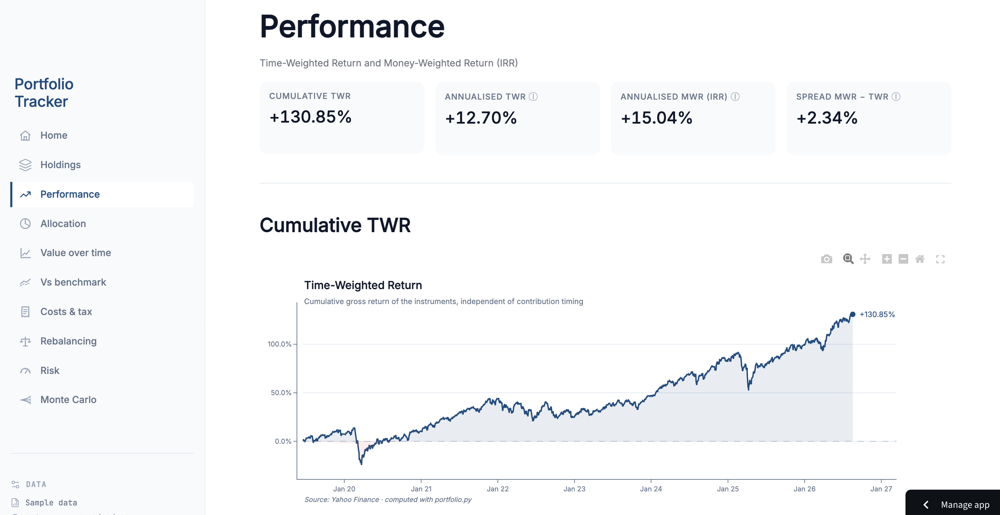

</div>

---

## Why this exists

Most retail tools tell you *how much money you have*. Very few tell you *how well you have actually invested it* — a distinction that matters enormously for a **PAC / DCA** investor who adds cash every month.

This app is built around two ideas:

1. **Separate the performance of the *instruments* from the performance of the *investor*.** Monthly contributions distort naive "value went up X%" numbers. The app reports **Time-Weighted Return (TWR)** — GIPS-compliant, contribution-neutral — alongside **Money-Weighted Return (MWR / IRR)**, which captures the effect of *when* you put money in.
2. **Be honest about costs, taxes and statistical noise.** Stamp duty, fees, capital-gains tax and short-history caveats are shown explicitly rather than hidden.

It doubles as a **methodology showcase**: the "why" behind each metric is documented, and the financial logic is deliberately kept in framework-free Python modules (see [Architecture](#architecture)).

> **Note on the screenshots below:** they use the built-in **sample portfolio** (three UCITS ETFs, ~2019→2026 of synthetic transactions), so any figures shown are illustrative.

---

## Highlights

- **TWR + MWR + spread** — instrument return, investor return, and the timing gap between them.
- **Benchmark comparison** with alpha, gross and net-of-cost.
- **Cash-flow rebalancing** — reaches the target allocation using new contributions only (no selling → no realised capital gains).
- **Cost & tax waterfall** — from gross P&L down to net-net P&L (fees → stamp duty → simulated capital-gains tax).
- **Risk suite** — annualised volatility, Sharpe, Sortino, beta, max drawdown with an underwater chart, plus confidence flags for short histories.
- **Monte Carlo projection** — probabilistic fan chart, nominal vs real (inflation-adjusted), and a "probability of reaching a goal" tool.
- **Zero-friction data entry** — fill an Excel template, upload, done. Or explore with one click via sample data.

---

## Feature tour

### Home — bring your own data, or explore the sample

Download the Excel template (sheets: `transactions`, `settings`, `TER`, `stamp duty`), fill in your buys, upload it — or hit **Try with sample data** to explore a pre-filled demo portfolio with no file required.

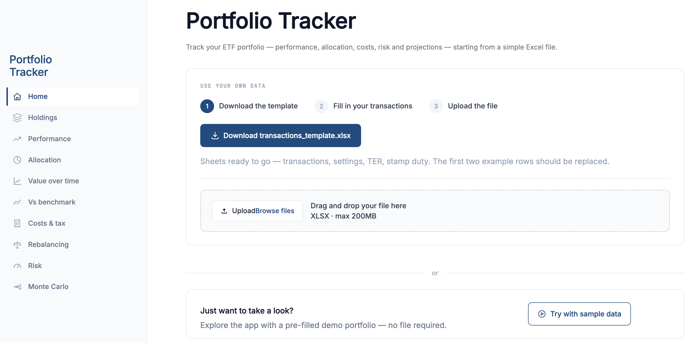

### Holdings — positions, P&L and weights

Weighted average cost, market value, and per-ticker P&L in € and %. Headline KPIs summarise invested capital, market value, total P&L and number of positions. P&L here is shown **gross** of stamp duty and capital-gains tax — those are attributed separately on the *Costs & tax* page.

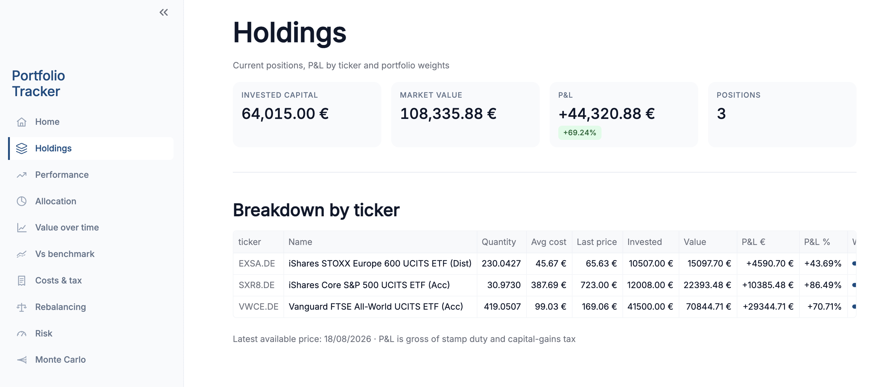

### Performance — TWR & MWR

The core performance page. **Cumulative TWR** and **annualised TWR** measure the instruments' return independent of contribution timing; **annualised MWR (IRR)** measures the return the investor actually earned given *when* they contributed. The **spread MWR − TWR** isolates the timing effect: positive means contributions were, on balance, well-timed.


### Allocation — composition vs target

Current composition (donut) next to **deviation from target** in percentage points, with a ±2% threshold band. This is what drives the rebalancing suggestions.

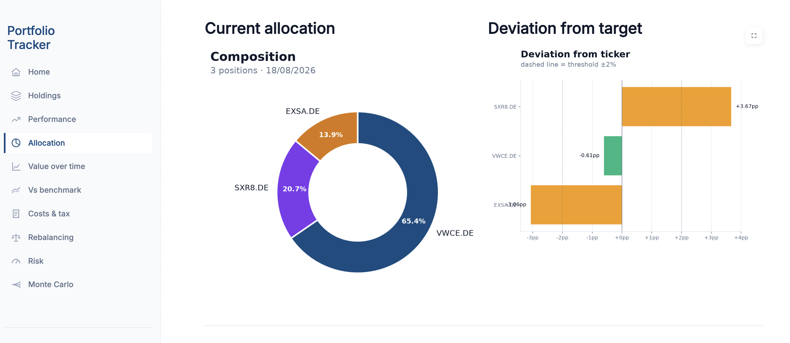

### Value over time — market value vs invested capital

Portfolio market value plotted against **cumulative invested capital**. The gap between the two lines is the P&L; the shaded area makes it immediately legible.

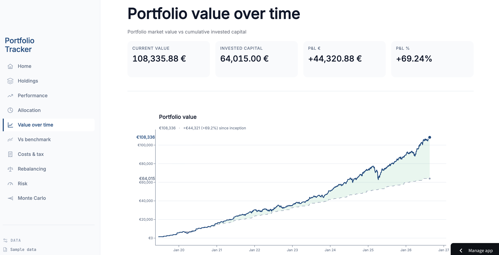

### Vs benchmark — normalised return & alpha

Portfolio TWR against a chosen benchmark, all series normalised to 1.0 on the first active day, with gross and net-of-stamp-duty variants and an **alpha** figure. When the benchmark is also one of the holdings, the app explains why the two tracks closely.

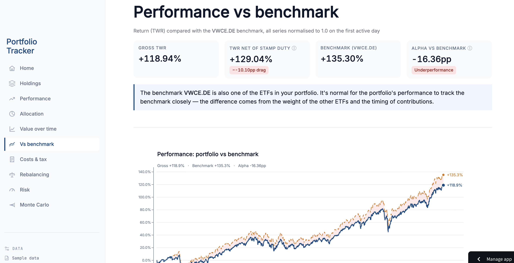

### Costs & tax — the gross → net-net waterfall

A waterfall from **gross P&L** down through **fees**, **stamp duty** and a **simulated capital-gains tax** ("if I sold today") to **net-net P&L**. The tax is explicitly hypothetical — you owe nothing until you actually sell (see [methodology](#costs--taxes)).

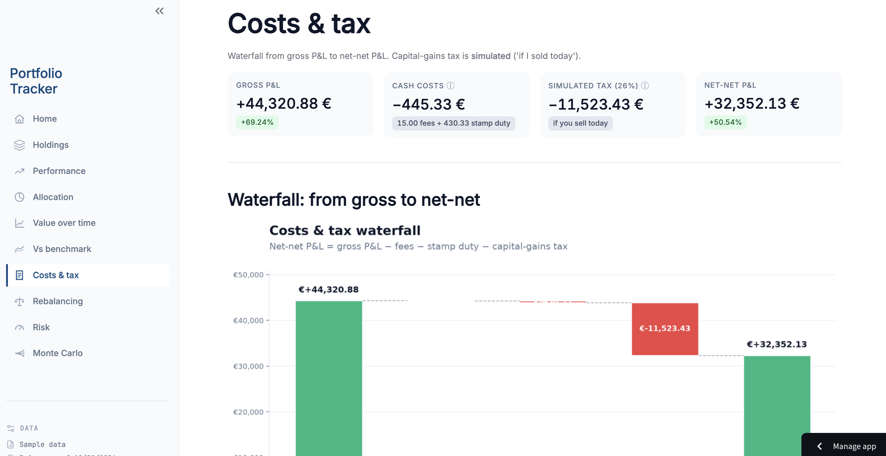

### Rebalancing — buy-only, single-buy first

Enter your next net contribution and the app proposes **buy orders only** that move the portfolio toward target. It prefers a **single buy** (one order, one fee) and only splits across two ETFs when the post-single-buy deviation would exceed the threshold. Every order shows quantity, fee, resulting weight and residual deviation.

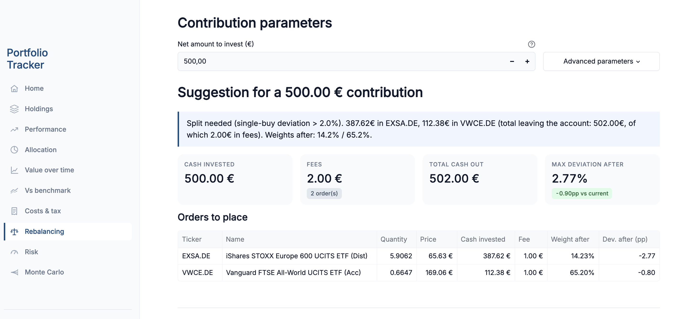

### Risk — volatility, ratios, beta and drawdowns

Annualised volatility, Sharpe and Sortino (vs a configurable risk-free rate), beta vs benchmark, and max-drawdown analysis with an **underwater chart** highlighting the deepest episodes and their recovery.

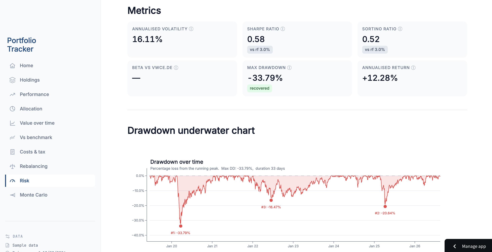

### Monte Carlo — probabilistic projection

Project the portfolio forward assuming the monthly contribution continues, with returns calibrated on the portfolio's own recent history.

Configure initial value, contribution, inflation, horizons, number of simulations and lookback:

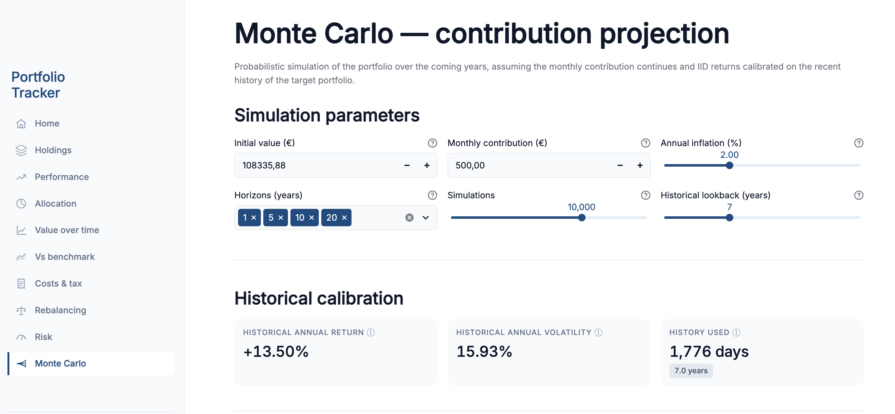

Read the outcome distribution as a **fan chart** (median plus percentile bands), with total contributed capital shown for reference:

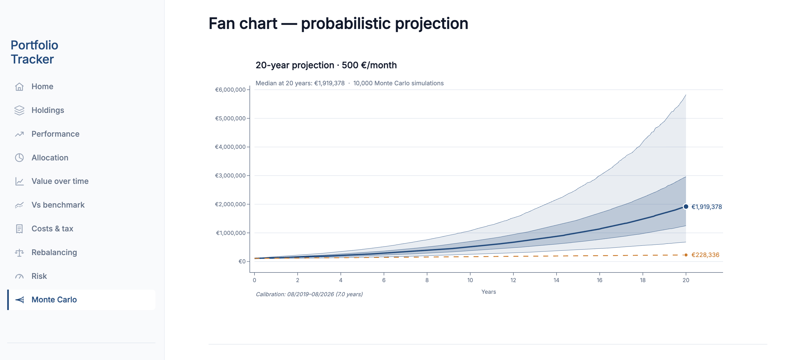

Or answer a goal question directly — *"what's the probability of exceeding €X in N years?"* — with a nominal vs **real (today's €)** toggle and an interpretation block that states the methodological caveats up front:

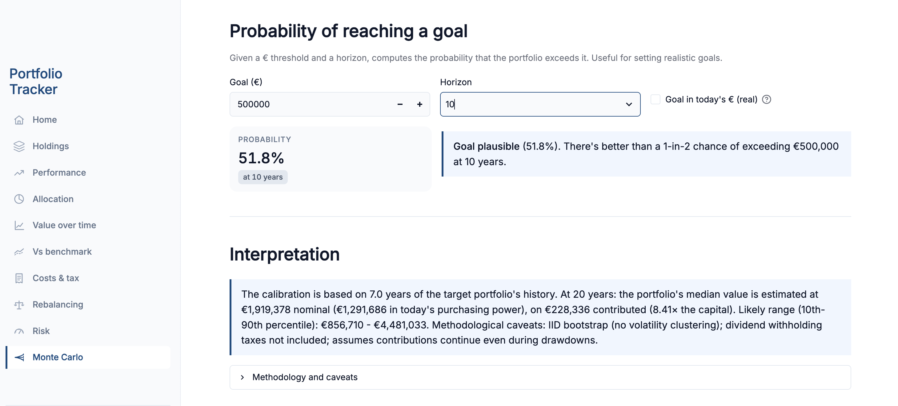

---

## Methodology & design decisions

The financial reasoning is the point of this project. Highlights below; the full rationale (including alternatives considered and things deliberately *not* built) lives in [`DESIGN_DECISIONS.md`](DESIGN_DECISIONS.md).

<details>
<summary><b>Performance — why both TWR and MWR</b></summary>

<br>

**TWR (GIPS-compliant)** is the primary metric. Daily sub-period returns strip out the effect of cash flows:

```
r_t     = (V_t − F_t) / V_{t−1} − 1
TWR_cum = ∏ (1 + r_t) − 1
```

It answers *"how did the instruments perform?"* and is comparable to a benchmark even for a portfolio that receives regular contributions.

**MWR (IRR)** is complementary. Solving for the internal rate of return on the actual cash-flow schedule (numerically, via `scipy.optimize.brentq`) answers *"what return did I, the investor, actually earn given when I contributed?"*

The **spread (MWR − TWR)** is the interesting bit: positive → contribution timing helped; negative → it hurt. For a DCA investor this is far more informative than either number alone.

**Caveat, surfaced in the UI:** annualising a return computed over less than a year overstates it dramatically through compounding, so the app flags short histories rather than quoting a confident annualised figure.

</details>

<details>
<summary><b>Rebalancing — cash-flow only, single-buy preferred</b></summary>

<br>

**No selling.** For Italian harmonised ETFs, selling realises gains taxed at 26%. The tax drag makes classic "sell-high / buy-low" rebalancing sub-optimal for a retail DCA investor, so the app rebalances using **new contributions only** — the monthly PAC naturally supplies the cash to correct drift.

**Single-buy first.** The algorithm tries to close the gap with a single order (one ~€1 fee) and only splits across two ETFs when (a) the post-single-buy deviation still exceeds the threshold **and** (b) a genuinely underweight second ticker exists. On a €500 contribution, an extra €1 fee is ~0.2% of drag — more than a year of stamp duty — so avoiding needless splits matters.

**2% threshold.** Drift under ~2% is treated as noise; the next contribution corrects it. This avoids the over-trading that plagues retail investors.

**Fractional shares** are allowed (Trade Republic style) so no cash is left uninvested. `new_cash` is interpreted as the **net** amount invested, with fees shown *on top* — matching the investor's mental model ("I want to invest €500" = €500 in ETFs + fee separately).

</details>

<details>
<summary><b>Costs & taxes</b></summary>

<br>

**Stamp duty (bollo)** is modelled daily as `current_value × 0.20% / 365`, accumulated over time, and shown next to the **actual** charges from the broker so the model can be checked against reality.

**TER is *not* subtracted** from P&L or return. For accumulating ETFs the TER is already reflected in the NAV daily, and the prices from Yahoo Finance already embed it — subtracting it again would be double-counting. It's shown separately as an educational, informational figure.

**Capital-gains tax (26%)** is **simulated** — "if I sold today". Losses on one position offset gains on another in a simultaneous liquidation (the Italian rule for harmonised ETFs); if the net is negative, tax is zero. The tax is hypothetical until you actually sell, and the app says so.

The **Costs & tax page** presents a waterfall in **euros** (not %): gross P&L → − fees → − stamp duty → − capital-gains tax → net-net P&L. Costs are real payments in €, so the waterfall shows where each euro of gross gain actually goes.

</details>

<details>
<summary><b>Risk metrics</b></summary>

<br>

- **252 trading days** for annualisation, not 365 — using calendar days overstates annual volatility by ~21%.
- **Drawdown is computed on the cumulative TWR series, not on market value.** In a portfolio with inflows, contributions mask real drawdowns (the market falls 3% but you add €500, so market value rises and the drawdown "disappears"). The contribution-neutral TWR captures the true decline.
- **Confidence flags** (`VERY_LOW` < 6m, `LOW` < 1y, `MEDIUM` < 3y, `HIGH` ≥ 3y): a Sharpe ratio over 7 months of data is dominated by noise, so the number is shown *with* a reliability caveat rather than presented as gospel.
- **Configurable risk-free rate** (default 3.0%, a realistic BTP 3y proxy for an Italian retail investor).
- **Deliberately excluded:** parametric VaR (assumes Gaussian tails, understates extremes), tracking error / information ratio (for active managers, not a near-replicating passive portfolio).

</details>

<details>
<summary><b>Monte Carlo projection</b></summary>

<br>

Returns are calibrated on the target portfolio's own recent history and simulated forward assuming the monthly contribution continues. Outputs: a fan chart (median + percentile bands), nominal **and** inflation-adjusted ("today's €") values, and a goal-probability tool.

**Caveats are stated in the UI, not buried:** IID bootstrap (no volatility clustering), dividend withholding taxes not included, and contributions assumed to continue even during drawdowns. The projection is a distribution of possibilities, not a forecast.

</details>

---

## Architecture

The guiding principle: **the financial logic never imports Streamlit.**

```
┌─────────────────────────────────────────────────────────────┐
│  Streamlit pages  (Holdings, Performance, Allocation, …)     │  ← presentation
├─────────────────────────────────────────────────────────────┤
│  streamlit_utils.py · plotly_style.py · chart_style.py       │  ← UI + styling
├─────────────────────────────────────────────────────────────┤
│  portfolio.py · costs.py · rebalance.py · risk.py ·          │  ← pure core
│  montecarlo.py         (framework-free, independently tested) │     (no Streamlit)
└─────────────────────────────────────────────────────────────┘
                              ▲
                     Excel → load_bundle() (cached) → st.session_state
```

**Why the split matters**

- The core is **reusable**: the same functions ran in a Jupyter notebook first, power the Streamlit app today, and could sit behind a FastAPI service tomorrow with no rewrite.
- Each function is **testable in isolation**, avoiding the "notebook spaghetti" anti-pattern where logic is duplicated across cells.
- A single source of truth for colours/palette (`chart_style.py`) is imported by both the matplotlib and Plotly styling layers, so the whole dashboard stays visually consistent.

**Core modules**

| Module | Responsibility |
|---|---|
| `portfolio.py` | Load transactions/settings, fetch prices, holdings, TWR, MWR, value series |
| `costs.py` | Stamp duty (modelled + actual), TER, simulated capital-gains tax, cost summary |
| `rebalance.py` | Cash-flow rebalancing (gap-closing), convergence projection |
| `risk.py` | Volatility, Sharpe, Sortino, beta, drawdown analysis, confidence flags |
| `montecarlo.py` | Bootstrap projection, percentile bands, goal probability |
| `chart_style.py` | Shared palette and chart styling primitives |

**Engineering detail worth noting:** the price cache is **coverage-aware** — a sidecar file tracks the date range actually cached *per ticker*, not just presence. Tracking only "is this ticker cached?" can serve stale ranges and produce spurious jumps in the TWR curve; tracking coverage prevents that.

---

## Tech stack

**Python 3.12** · **Streamlit** (multi-page) · **Plotly** + **matplotlib** · **pandas** / **numpy** · **scipy** (IRR solver) · **yfinance** (EOD prices) · **openpyxl** (Excel) · **pyarrow** (Parquet cache). Deployed on **Streamlit Community Cloud**.

---

## Getting started

```bash
# 1. clone
git clone https://github.com/USERNAME/portfolio-tracker.git
cd portfolio-tracker

# 2. install
python -m venv .venv && source .venv/bin/activate   # Windows: .venv\Scripts\activate
pip install -r requirements.txt

# 3. run  (adjust the entrypoint filename to match your repo)
streamlit run Home.py
```

Then either upload a filled-in template or click **Try with sample data**.

### Data model

The Excel template ships ready to fill, with four sheets:

| Sheet | Purpose |
|---|---|
| `transactions` | Your buys — date, ticker, quantity, price, fee |
| `settings` | Target allocation, benchmark, risk-free rate, thresholds |
| `TER` | Per-ETF expense ratio (informational) |
| `stamp duty` | Actual stamp-duty charges from the broker (to check the model) |

The first two example rows in `transactions` are placeholders and should be replaced.

---

## Roadmap

- [ ] `tax.py` — carry-forward of realised losses (4-year expiry), tax-aware ETF-switch suggestions
- [ ] Portfolio diversification module (look-through to underlying holdings / sectors / geography)
- [ ] Optional v2: extract the Python core behind a FastAPI service
- [ ] Automated tests (`pytest`) on the core modules

---

## Disclaimer

This project is for **educational and informational purposes only**. It is **not** investment, tax or financial advice. Figures shown in the screenshots come from synthetic sample data. Tax modelling reflects a specific reading of the Italian regime for harmonised ETFs and may be incomplete or out of date — verify with a qualified professional before acting. Market data is sourced from Yahoo Finance and provided "as is".

---

## License

Released under the **MIT License** — see [`LICENSE`](LICENSE).

## Author

**Michele Acquasaliente** — Financial Analyst & Advisory Consultant, CFA Level I.
Built as a personal PAC tracking tool and a methodology-forward portfolio piece.
